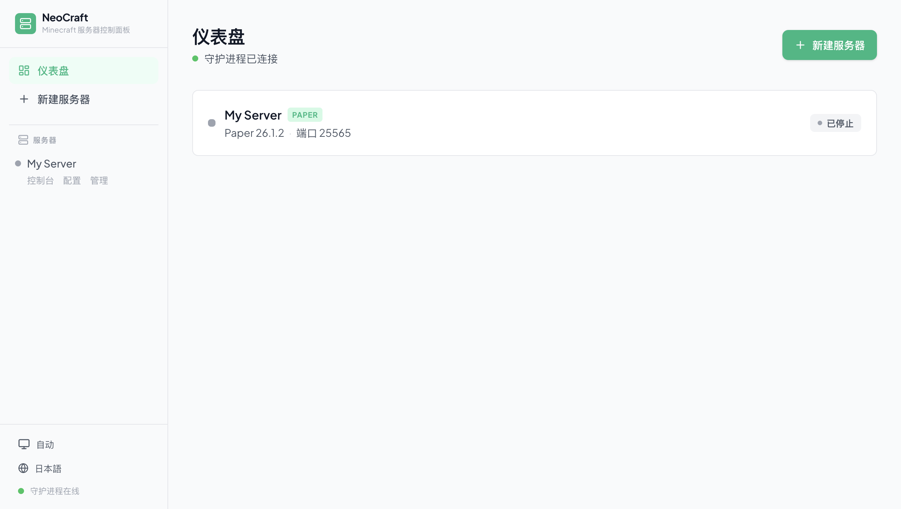

<p align="center">
  
</p>

# NeoCraft

**NeoCraft 是一个跨平台 Minecraft 服务器控制面板。** 它由 React Web 界面、Fastify API 服务和 Rust 守护进程组成，可在浏览器中集中创建、运行、监控、配置和运维 Minecraft 服务器。

[English](README.md)



## 核心特点

- **多实例管理**：创建、导入、启动、停止、重启和删除彼此隔离的 Minecraft 服务器实例。
- **引导式创建**：解析并下载 Paper、Vanilla、Spigot、Fabric 服务端；支持导入自定义、Forge 和已有整合包目录。
- **实时运维**：通过 WebSocket 实时查看控制台日志、发送命令、跟踪状态变化和 CPU/内存占用。
- **配置工具**：在 Web UI 中编辑 `server.properties`、JVM 参数、Java 路径、实例文件和 MOTD。
- **管理面板**：新版本服务器使用 SMP，旧版本使用 RCON，覆盖玩家、聊天、白名单、封禁、管理员、游戏规则和服务器设置。
- **Mod/插件流程**：扫描已安装 Mod，并在可信直链可用时从 Modrinth、Spiget、Hangar 等来源安装 Mod 或插件。
- **精致界面**：React 响应式界面，内置浅色、深色、Minecraft Classic、Minecraft Modern 主题。
- **更安全的本地架构**：守护进程通过 Unix Socket 或 Windows 命名管道通信并使用令牌认证；API 提供可选 Bearer 认证和请求限流。

## 架构

```text
浏览器 (React + Vite)
        |
        | REST + WebSocket
        v
Node.js API (Fastify)
        |
        | JSON Lines over Unix socket / Windows named pipe
        v
Rust 守护进程 (tokio)
        |
        | 进程、日志、文件、下载和资源监控
        v
Minecraft 服务器实例
```

API 服务负责提供 Web UI、REST/WebSocket 接口，并把需要本机权限的操作代理给守护进程。守护进程负责服务器进程、日志、资源监控、下载缓存、实例文件和本地 IPC 认证。

## 环境要求

- macOS、Linux 或 Windows
- Node.js 22+
- Rust 工具链
- Java 21+，用于运行新版 Minecraft 服务端

## 快速开始

```bash
git clone https://github.com/SoraStr/NeoCraft.git
cd NeoCraft

npm install
(cd server && npm install)
(cd frontend && npm install)

npm run dev
```

打开 <http://localhost:1145>。开发模式下，Vite 前端运行在 `1145`，API 服务 `neocraft-server` 运行在 `3001`。

## 构建

```bash
npm run build
node build/start.mjs
```

生产构建会包含编译后的前端、Node.js 服务端、生产依赖和 Rust 守护进程二进制文件。默认监听 <http://127.0.0.1:3001>；可通过 `PORT` 或 `NEOCRAFT_PORT` 修改端口。

## 常用脚本

| 命令 | 说明 |
| --- | --- |
| `npm run dev` | 开发模式启动守护进程、API 服务和前端 |
| `npm run build` | 构建全部组件 |
| `npm test` | 运行守护进程、服务端和前端测试 |
| `npm run dev:daemon` | 仅启动 Rust 守护进程 |
| `npm run dev:server` | 仅启动 Fastify API 服务 |
| `npm run dev:frontend` | 仅启动 Vite 前端 |

## 项目结构

```text
daemon/     Rust 守护进程：进程、IPC、文件、下载和监控
server/     Fastify API、WebSocket 中枢、守护进程运行时、市场和版本服务
frontend/   React + Vite + Tailwind Web 应用
scripts/    开发与生产构建脚本
docs/       设计和实现文档
```

## 配置

常用环境变量：

| 变量 | 默认值 | 说明 |
| --- | --- | --- |
| `PORT` | `3001` | API 监听端口 |
| `HOST` | `127.0.0.1` | API 监听地址 |
| `NEOCRAFT_DATA_DIR` | `~/.neocraft` | 实例数据、缓存和守护进程令牌目录 |
| `NEOCRAFT_SOCKET` | 平台默认 | 守护进程 Socket 路径或 Windows 管道名称 |
| `NEOCRAFT_FRONTEND_DIST` | `frontend-dist` | 生产模式前端静态文件目录 |
| `NEOCRAFT_AUTO_START_DAEMON` | `true` | API 服务启动时自动启动守护进程 |
| `NEOCRAFT_CORS_ORIGINS` | 本地开发来源 | 逗号分隔的 CORS 允许列表 |

守护进程参数：

```text
neocraft-daemon --socket <路径> --data-dir <路径>
```

## 许可证

MIT
