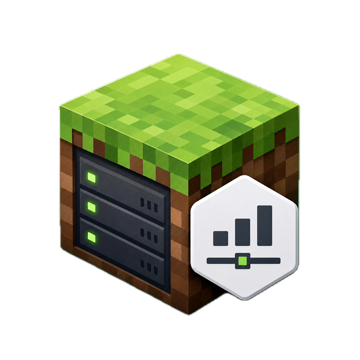
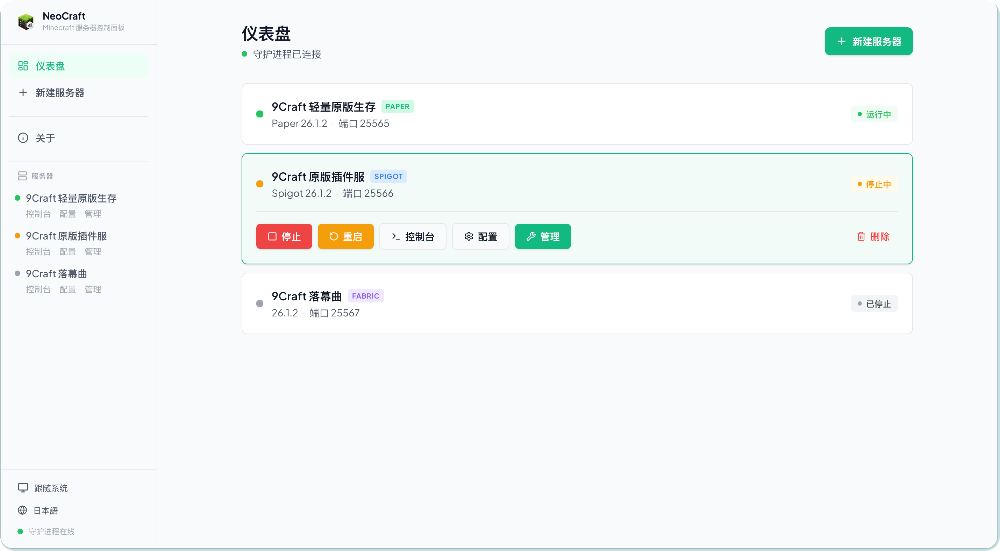
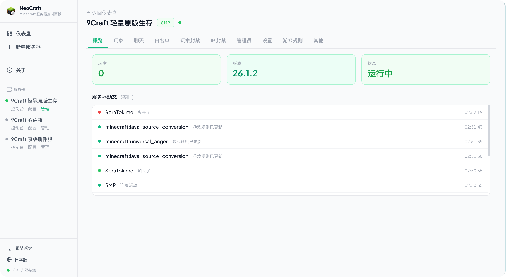
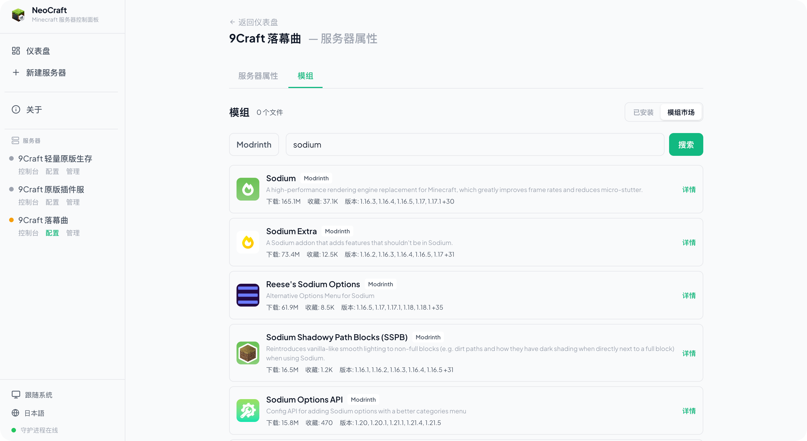

<p align="center">
  
</p>

# NeoCraft

**NeoCraft is a cross-platform Minecraft server control panel.** It combines a React web UI, a Fastify API server, and a Rust daemon to create, run, monitor, configure, and administer Minecraft servers from one browser-based dashboard.

[简体中文](README-ZH.md)

## Screenshots


*Main dashboard with server instances overview*


*Server console with live logs, player tracking, and status monitoring*


*Built-in marketplace for browsing and installing mods/plugins*

## Highlights

- **Multi-instance control**: create, import, start, stop, restart, and delete isolated Minecraft server instances.
- **Guided server setup**: resolve and download Paper, Vanilla, Spigot, and Fabric server builds; import custom, Forge, and preconfigured server folders.
- **Live operations**: stream console logs, send commands, watch state changes, and track CPU/memory usage through WebSocket events.
- **Configuration tools**: edit `server.properties`, JVM arguments, Java runtime path, files, and MOTD from the web UI.
- **Administration panel**: manage players, chat, allowlist, bans, operators, gamerules, and settings through SMP on newer servers or RCON on older ones.
- **Mod/plugin workflow**: scan installed mods and install from supported Modrinth, Spiget, and Hangar sources where trusted direct downloads are available.
- **Polished UI**: responsive React interface with light, dark, Minecraft Classic, and Minecraft Modern themes.
- **Safer local architecture**: daemon IPC uses Unix sockets or Windows named pipes with token authentication; the API adds optional Bearer auth and request rate limiting.

## Architecture

```text
Browser (React + Vite)
        |
        | REST + WebSocket
        v
Node.js API (Fastify)
        |
        | JSON Lines over Unix socket / Windows named pipe
        v
Rust daemon (tokio)
        |
        | process, log, file, download, and resource management
        v
Minecraft server instances
```

The API server serves the web UI, exposes REST/WebSocket endpoints, and proxies privileged operations to the daemon. The daemon owns server processes, logs, resource monitoring, downloads, instance files, and local IPC authentication.

## Requirements

- macOS, Linux, or Windows
- Node.js 22+
- Rust toolchain
- Java 21+ for modern Minecraft servers

## Quick Start

```bash
git clone https://github.com/SoraStr/NeoCraft.git
cd NeoCraft

npm install
(cd server && npm install)
(cd frontend && npm install)

npm run dev
```

Open <http://localhost:1145>. In development, Vite runs on `1145` and proxies API requests to `neocraft-server` on `3001`.

## Build

```bash
npm run build
node build/start.mjs
```

The production build includes the compiled frontend, Node.js server, production server dependencies, and the Rust daemon binary. By default, the server listens on <http://127.0.0.1:3001>; set `PORT` or `NEOCRAFT_PORT` to change it.

## Useful Scripts

| Command | Description |
| --- | --- |
| `npm run dev` | Start daemon, API server, and frontend for development |
| `npm run build` | Build all components |
| `npm test` | Run daemon, server, and frontend tests |
| `npm run dev:daemon` | Run only the Rust daemon |
| `npm run dev:server` | Run only the Fastify API server |
| `npm run dev:frontend` | Run only the Vite frontend |

## Project Layout

```text
daemon/     Rust daemon for process, IPC, file, download, and monitor work
server/     Fastify API, WebSocket hub, daemon runtime, market/version services
frontend/   React + Vite + Tailwind web application
scripts/    Development and production build scripts
docs/       Design and implementation notes
```

## Configuration

Common environment variables:

| Variable | Default | Description |
| --- | --- | --- |
| `PORT` | `3001` | API listen port |
| `HOST` | `127.0.0.1` | API listen host |
| `NEOCRAFT_DATA_DIR` | `~/.neocraft` | Instance data, cache, and daemon token directory |
| `NEOCRAFT_SOCKET` | platform default | Daemon socket path or Windows pipe name |
| `NEOCRAFT_FRONTEND_DIST` | `frontend-dist` | Static frontend directory for production |
| `NEOCRAFT_AUTO_START_DAEMON` | `true` | Auto-start the daemon with the API server |
| `NEOCRAFT_CORS_ORIGINS` | local dev origins | Comma-separated CORS allowlist |

Daemon options:

```text
neocraft-daemon --socket <PATH> --data-dir <PATH>
```

## License

MIT
